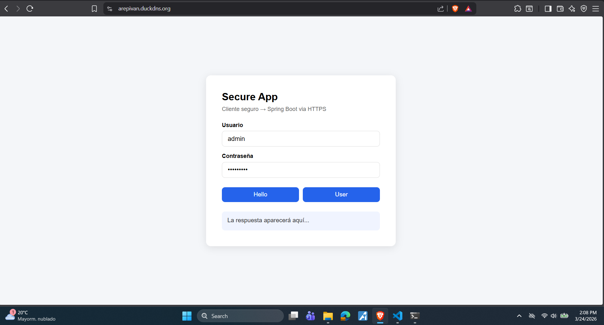
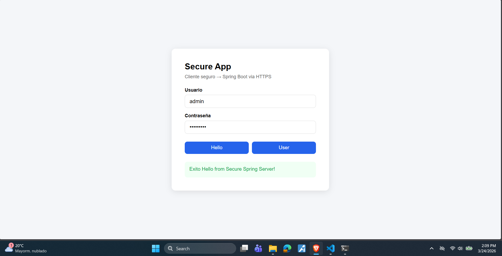
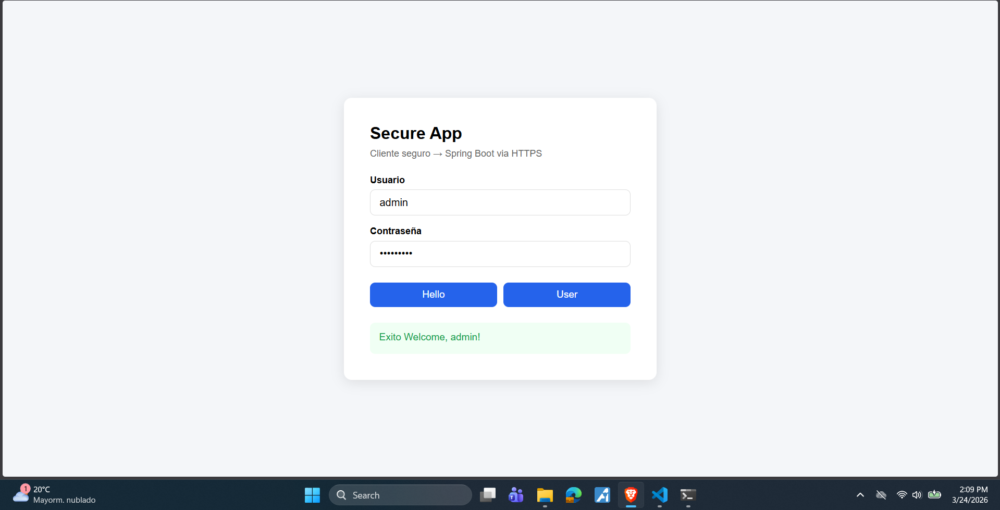
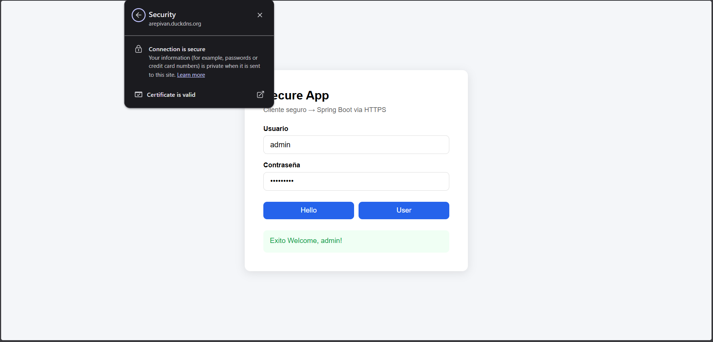
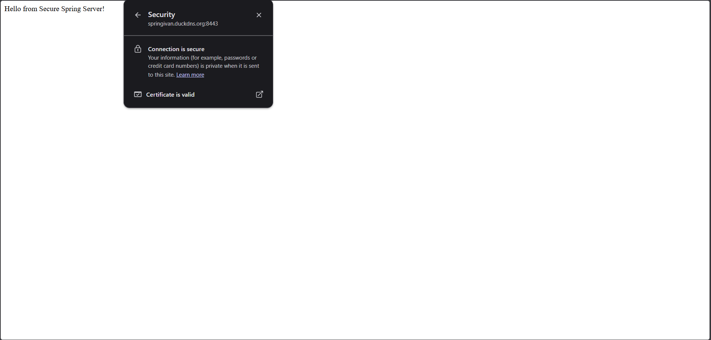
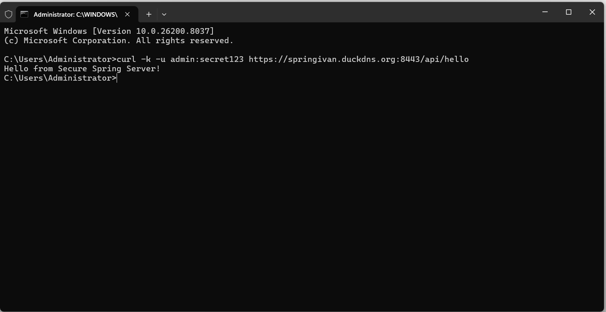
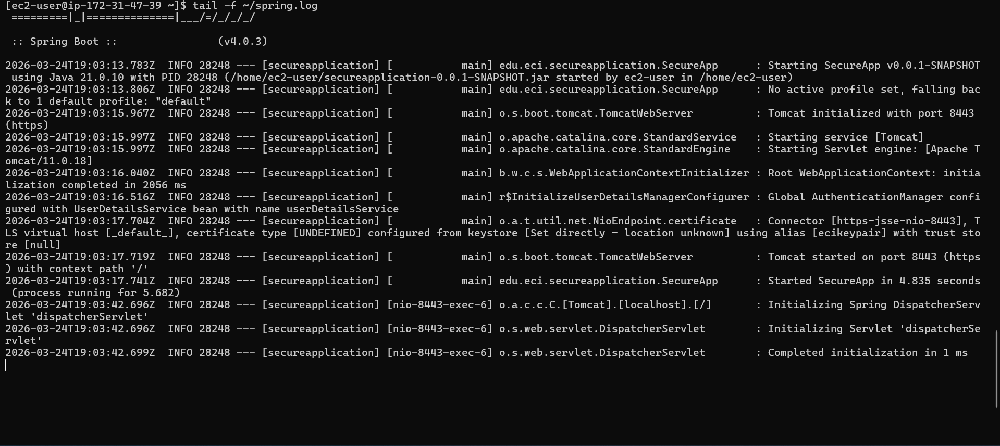
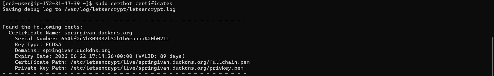
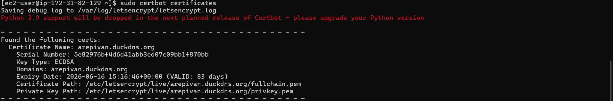

# Taller de Arquitectura Segura — AREP

**Autor:** Ivan Camilo Cubillos  
**Curso:** Arquitectura de Aplicaciones Empresariales (AREP)  
**Institución:** Escuela Colombiana de Ingeniería Julio Garavito  
**Fecha:** Marzo 2026

---

## Descripción

Aplicación web segura desplegada en AWS con dos servidores independientes en EC2. El sistema garantiza confidencialidad, integridad y autenticación en todas las capas de comunicación mediante TLS (Let's Encrypt) y autenticación con contraseñas hasheadas (BCrypt).

---

## Arquitectura

```
Usuario (Navegador)
        │
        │ HTTPS (Puerto 443)
        ▼
┌─────────────────────┐
│     EC2 #1          │
│  Apache HTTP Server │  ← Sirve cliente HTML+JS
│  TLS: Let's Encrypt │
│  arepivan.duckdns.org│
└─────────────────────┘
        │
        │ HTTPS (Puerto 8443) — fetch() asíncrono
        ▼
┌─────────────────────┐
│     EC2 #2          │
│   Spring Boot 3.x   │  ← API REST
│  TLS: Let's Encrypt │
│  Spring Security    │
│  BCrypt Passwords   │
│springivan.duckdns.org│
└─────────────────────┘
```

### Componentes

| Componente | Tecnología | Descripción |
|---|---|---|
| Servidor 1 | Apache HTTP Server | Sirve el cliente web estático con TLS |
| Servidor 2 | Spring Boot 3 + Java 21 | API REST con autenticación y TLS |
| Certificados | Let's Encrypt (Certbot) | TLS en ambos servidores |
| Autenticación | Spring Security + BCrypt | Passwords hasheadas, nunca texto plano |
| Cliente | HTML + JavaScript (async/fetch) | Comunicación asíncrona con el backend |

---

## Características de Seguridad

- **TLS en ambos servidores** — Toda comunicación viaja cifrada sobre HTTPS
- **Certificados Let's Encrypt** — Certificados de confianza pública, renovación automática
- **BCrypt Password Hashing** — Las contraseñas nunca se almacenan en texto plano
- **Spring Security** — Control de acceso a endpoints REST
- **CORS configurado** — Solo el dominio de Apache puede llamar al backend
- **12-Factor App** — Configuración sensible leída desde variables de entorno

---

## Estructura del Proyecto

```
secureapplication/
├── src/
│   └── main/
│       ├── java/edu/eci/arep/
│       │   ├── SecureApp.java          ← Entry point
│       │   ├── HelloController.java    ← Endpoints REST
│       │   └── SecurityConfig.java     ← BCrypt + CORS + Spring Security
│       └── resources/
│           └── application.properties  ← Configuración TLS
└── pom.xml
```

---

## Requisitos Previos

- Java 21
- Maven 3.x
- Cuenta AWS con dos instancias EC2 (Amazon Linux 2023)
- Dominios apuntando a cada instancia (para Let's Encrypt)
- Puertos abiertos: **443** (Apache), **8443** (Spring), **80** (Certbot)

---

## Instrucciones de Despliegue

### EC2 #1 — Apache con TLS

```bash
# 1. Instalar Apache
sudo dnf install httpd -y
sudo systemctl start httpd
sudo systemctl enable httpd

# 2. Instalar Certbot y generar certificado
sudo dnf install certbot python3-certbot-apache -y
sudo certbot --apache -d arepivan.duckdns.org

# 3. Colocar el cliente HTML en el directorio web
sudo nano /var/www/html/index.html
```

### EC2 #2 — Spring Boot con TLS

```bash
# 1. Instalar Java 21
sudo dnf install java-21-amazon-corretto -y

# 2. Generar certificado Let's Encrypt
sudo dnf install certbot -y
sudo certbot certonly --standalone -d springivan.duckdns.org

# 3. Convertir certificado a formato PKCS12 para Spring
sudo openssl pkcs12 -export \
  -in /etc/letsencrypt/live/springivan.duckdns.org/fullchain.pem \
  -inkey /etc/letsencrypt/live/springivan.duckdns.org/privkey.pem \
  -out /home/ec2-user/ecikeystore.p12 \
  -name ecikeypair \
  -passout pass:123456

# 4. Dar permisos de lectura al keystore
sudo chmod 644 /home/ec2-user/ecikeystore.p12

# 5. Subir el JAR desde local
# (ejecutar en tu máquina local)
scp -i "tu-key.pem" target/secureapplication-0.0.1-SNAPSHOT.jar \
  ec2-user@<IP-EC2-2>:/home/ec2-user/

# 6. Ejecutar en background
nohup java -jar ~/secureapplication-0.0.1-SNAPSHOT.jar \
  --server.ssl.key-store=file:/home/ec2-user/ecikeystore.p12 \
  --server.ssl.key-store-password=123456 \
  --server.ssl.key-store-type=PKCS12 \
  --server.ssl.key-alias=ecikeypair \
  --server.ssl.enabled=true \
  --server.port=8443 > ~/spring.log 2>&1 &
```

### Compilar el proyecto en local

```bash
git clone https://github.com/IvanCamiloCubillos13/secure-spring-server.git
cd secure-spring-server
mvn clean package -DskipTests
```

---

## Endpoints disponibles

| Método | Endpoint | Auth requerida | Descripción |
|---|---|---|---|
| GET | `/api/hello` | Basic Auth | Saludo del servidor |
| GET | `/api/user?name={nombre}` | Basic Auth | Saludo personalizado |

### Credenciales de prueba

| Usuario | Contraseña | Rol |
|---|---|---|
| admin | secret123 | USER |

> Las contraseñas se almacenan hasheadas con BCrypt — nunca en texto plano.

---

## Pruebas

### Verificar Spring Boot (desde terminal)

```bash
# Sin credenciales — debe retornar 401
curl -k https://springivan.duckdns.org:8443/api/hello

# Con credenciales — debe retornar el mensaje
curl -k -u admin:secret123 https://springivan.duckdns.org:8443/api/hello

# Endpoint user
curl -k -u admin:secret123 "https://springivan.duckdns.org:8443/api/user?name=Ivan"
```

### Verificar Apache (desde navegador)

Abrir: `https://arepivan.duckdns.org`

---

## Screenshots

### 1. Cliente web cargado desde Apache (HTTPS)
> 

### 2. Respuesta exitosa — endpoint `/api/hello`
> 

### 3. Respuesta exitosa — endpoint `/api/user`
> 

### 4. Certificado TLS válido en ambos dominios
> 
> 

### 5. Curl con autenticación exitosa
> 

### 6. Spring Boot corriendo en background
> 

### 7. Certificados Let's Encrypt activos
> 
> 

---

## Principios Aplicados

### 12-Factor App
La configuración sensible (keystore path, password, puerto) se pasa como argumentos al runtime y puede leerse desde variables de entorno — nunca está hardcodeada en el código fuente.

```bash
# Ejemplo con variables de entorno
export KEYSTORE_PASSWORD=123456
export PORT=8443
java -jar app.jar --server.ssl.key-store-password=${KEYSTORE_PASSWORD}
```

### Separación de responsabilidades
- **Apache** → entrega de assets estáticos al cliente
- **Spring Boot** → lógica de negocio y autenticación
- **Let's Encrypt** → gestión de certificados TLS

---

## Decisiones de Seguridad

| Decisión | Justificación |
|---|---|
| BCrypt para passwords | Algoritmo de hashing adaptativo, resistente a ataques de fuerza bruta |
| PKCS12 en lugar de JKS | Estándar de la industria, no propietario de Java |
| Let's Encrypt en vez de certificado autofirmado | Certificados de confianza pública, evita advertencias en el navegador |
| CORS restringido por dominio | Solo `arepivan.duckdns.org` puede llamar al backend |
| HTTPS en ambos servidores | Garantiza confidencialidad e integridad en toda la comunicación |